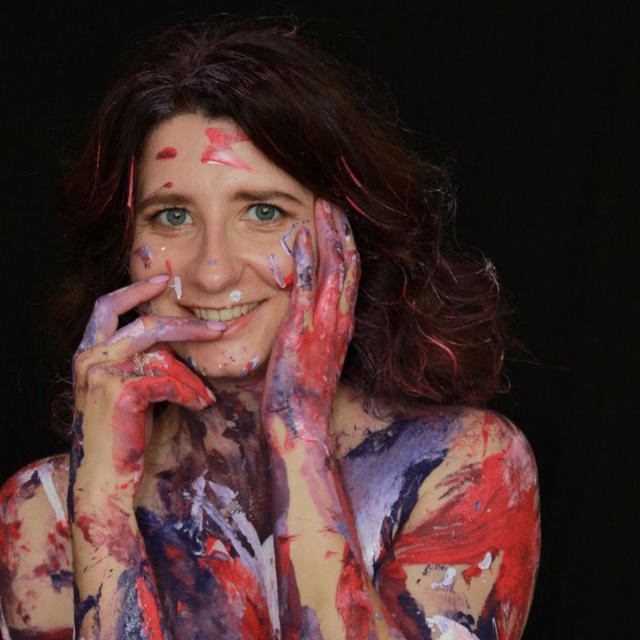

# Vera Khremli



## Contacts:

* Phone [+375298550739](tel:+375298550739)
* Telegram @Vera_Khremli
* mail
    + [vera-khremli@gmail.com](mailto:vera-khremli@gmail.com)
* Discord Vera Khremli (@khremli-vera)

## About myself:
My **goal**: to become frontend developer, at the moment to develop myself in learning js and then learn several frameworks.

My **strengths** are the ability to communicate with different types of people, smartness, eagerness to understand things, honesty, politeness and diligence. 

## Skills:

* Project-managment methodologies (scrum, kanban);
* BTN jira, redmine, trello, asana;
* Figma, Adobe photoshop, Miro;
* WP, Shopify, Gatsby, Netlify, Sanity, Moodle, “OpenCart”, “Magento” - as QA;
* CRM ActiveCampaign, Mailchimp, SalesForce, Confluence;
* devtools, android studio, emulators, jmeter;
* API testing: Postman, Charles (basics)
* SEO basics;
* business correspondence (with Clients, the team);
* JS basics;
* HTML basics;
* CSS basics;
* SQL basics;
* Git, GitLab

## Code
```
function unique(arr) {
  let uniqueItems = [];
  for (let i = 0; i < arr.length; i++) {
    element = arr[i];
    let itemArr=[];
    for (let item of arr) {
      itemArr = arr.filter(item => item == element);
      }    
    if (itemArr.length == 1) {
      uniqueItems.push(element)
    }    
    itemArr = itemArr.splice(0, itemArr.length);    
  }
  return uniqueItems;
}
```

## My experience

I am currently working as a manual QA and also as project manager assistant on some projects for 2 years. I work in outsourcing, so multitasking and switching is something I know, can do and practise every day. I like to see things through to the end and love my projects. We bring each of them together with the team to get the best results and see positive feedback from the client

## Projects:

html-academy: 
* training project "Kvast" landing (html + css);
* training simulators for creating interactive elements (sliders, toggles, forms, catalogues) (html + css+js)
* training project "Library" landing (html + css+js);
* training project ["CV"](https://github.com/khremli-vera/rsschool-cv/blob/gh-pages/cv.md)

## Education:

|Education/courses                                              | Period    |
|---------------------------------------------------------------|-----------|
|Completed higher education / BNTU Civil engineering            | 2007-2012 |
|“Software Testing Introduction” course / EPAM                  | 2022      |
|“Computer Science Basics” course / EPAM                        | 2022      |
|“Tester from scratch” online course                            | 2022      |
|Moodle basics                                                  | 2022      |
|SEO Learning course                                            | 2023      |
|API Testing. Postman                                           | 2023      |
|"JS from scratch" course                                       | 2023      |
|"JS online guide" course                                       | 2024      |
|HTML-academy simulators                                        | 2024      |

### Certificates: 
* “Software Testing Introduction” [Certificate](https://drive.google.com/file/d/1bh5mVZp-sm7e_v3_MkQe8BP0YLyCe47w/view?usp=sharing)
* JS online guide [Certificate](https://drive.google.com/file/d/1g9GDVfu9HG19t7mK3cZEWExc8qP2ySoR/view?usp=sharing)

## Languages

* English B1
The language practice takes place by communicating with colleagues, business correspondence, using sources for education in English
* German basics
